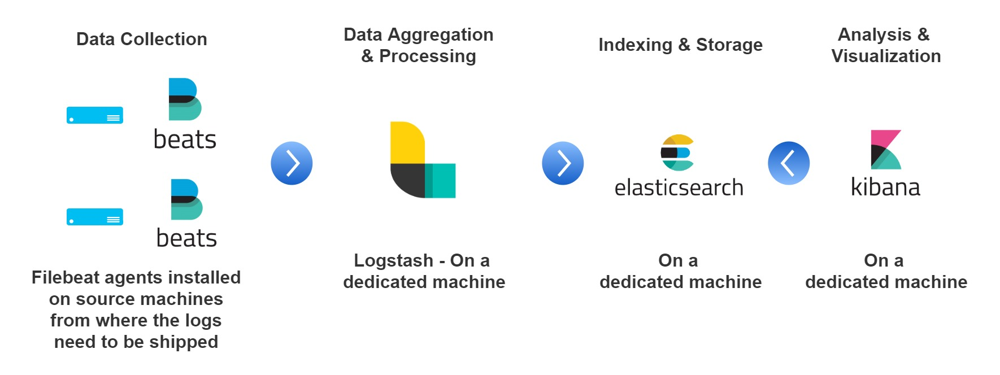

The ELK (Elasticsearch, LogStash, and Kibana) stack can be quite handy in log processing and monitoring. However, there are some of the formidable pre-requisites such as, having a node dedicated to host LogStash. But, not everyone can afford to host their very own log processing instance. This is where, FEK (Fluentd, Elasticsearch, and Kibana) stack can help.  

## ELK Stack

ELK Stack will be covered in a separate article, in detail. To give a brief overview, the components that make up the ELK stack are:

* Beats - To ship the logs from the source location. E.g.: Filebeats, and Metricbeats.
* Logstash - The log Processing framework, contains pipelines defined to selectively choose the sections of the logs and transforms them into key-value paired JSON objects.
* Elasticsearch - The search engine where the data from Logstash are stored.
* Kibana - The visualization engine that queries the data from elasticsesarch.

Put together, all these components can be visualized in the infographic shown below:



## Fluentd 

The FEK Stack differs from ELK by the fact that there is no need for Logstash for transformation. Fluentd (also known as *td-agent*) can help in reading, transforming, and shipping the logs directly to the Logstash. These transformed and shipped logs can be visualized in Kibana same as the ELK Stack.


The fluentd agents can be installed based on the instructions given in this link (https://docs.fluentd.org/installation).
Now that the fluentd agent has been installed, let's explore how the agent is able to transform and ship the corresponding logs. For this example, you can clone the following repository: https://github.com/datawrangl3r/logGenerator as:

```
git clone https://github.com/datawrangl3r/logGenerator
cd logGenerator
python3 generator.py -i 1000
```

Executing the above snippet will generate a log file in the current directory with the filename as: `YYYY-MM-DD` representing the logs generated for the day. A preview of the file should resemble something like:

```
2018-12-06 01:55:02 lumen.CRITICAL: API-1 Exhausted  => {"message":"Your balance is too low to make an API call"}
2018-12-06 01:55:02 lumen.INFO: ProductStatusID changed => {"produt_id":"{}"}
2018-12-06 01:55:02 lumen.CRITICAL: API-1 Exhausted  => {"message":"Your balance is too low to make an API call"}
2018-12-06 01:55:02 lumen.WARNING: Import Warning => {"message":"The package sounds to be deprecated"}
2018-12-06 01:55:02 lumen.WARNING: Import Warning => {"message":"The usage of printf function is obsolete"}
2018-12-06 01:55:02 lumen.INFO: API-1 HIT  => {"message":"successfully verified"}
2018-12-06 01:55:02 lumen.CRITICAL: API-1 Exhausted  => {"message":"Your balance is too low to make an API call"}
2018-12-06 01:55:02 lumen.INFO: User_id created => {"user_id":"{}"}
```

The logs that are to be shipped and transformed need to identified and the matching grok pattern needs to be determined. Upon examining the above lines, the grok pattern is found to be:

```
/\[(?<timestamp>.*)\] (?<source>.*)\.(?<severity>.*): (?<message>.*)=>(?<identifier>.*)$/ 
```

Hence, the following configuration is placed in the location `/etc/td-agent/` under the file name `td-agent.conf` of the source machine as:

```conf
<source>
  format none
  @type tail
  path /home/ubuntu/logGenerator/*.log
  pos_file /var/log/td-agent/buffer/demolog.log.pos
  read_from_head true
  format /\[(?<timestamp>.*)\] (?<source>.*)\.(?<severity>.*): (?<message>.*)=>(?<identifier>.*)$/ 
  tag s3.demolog
</source>

<match s3.demolog>
  <store>
        type elasticsearch
        host localhost
        port 9200
	index_name demolog
        include_tag_key true
        tag_key @log_name
        logstash_format true
        flush_interval 10s
  </store>
</match>
```

In the above configuration, the path corresponds to the path of the logGenerator which contains the log file. Since, the new set of configuration has been put for td-agent, a reload operation needs to be done to consider this configuration file as:

```
> sudo service td-agent reload
```

This will reload the configuration and start to transform the contents of the destination log file. The configuration file tells the td-agent to ship the transformed content to the defined elasticsearch host, thereby completing the flow.

## Conclusion

In this article, we have learned about the log aggregation frameworks ELK and FEK, when to take the cognitive decision to use ELK or FEK and also, we worked on a small example to demonstrate how the FEK stack works. 
